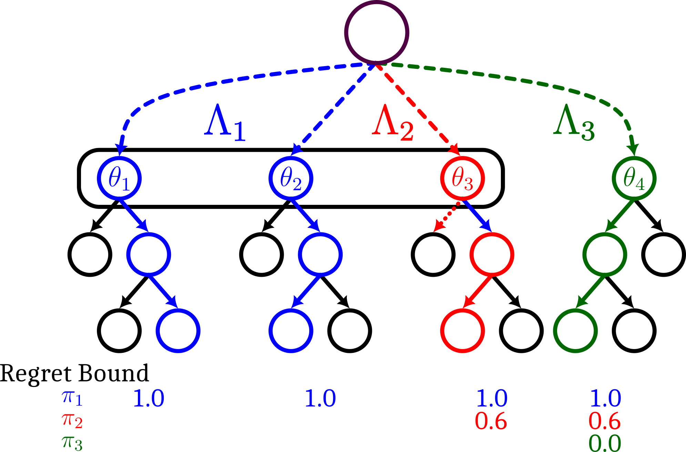
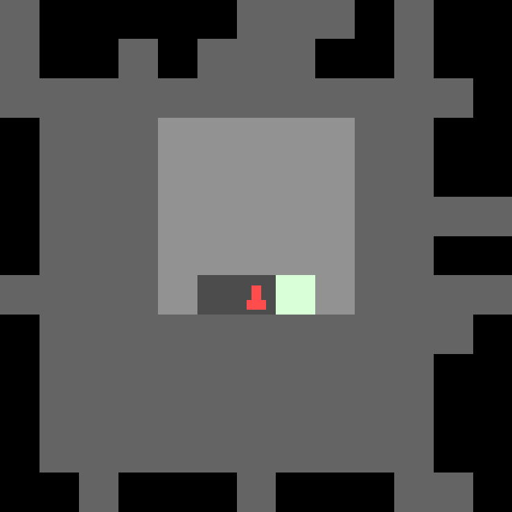
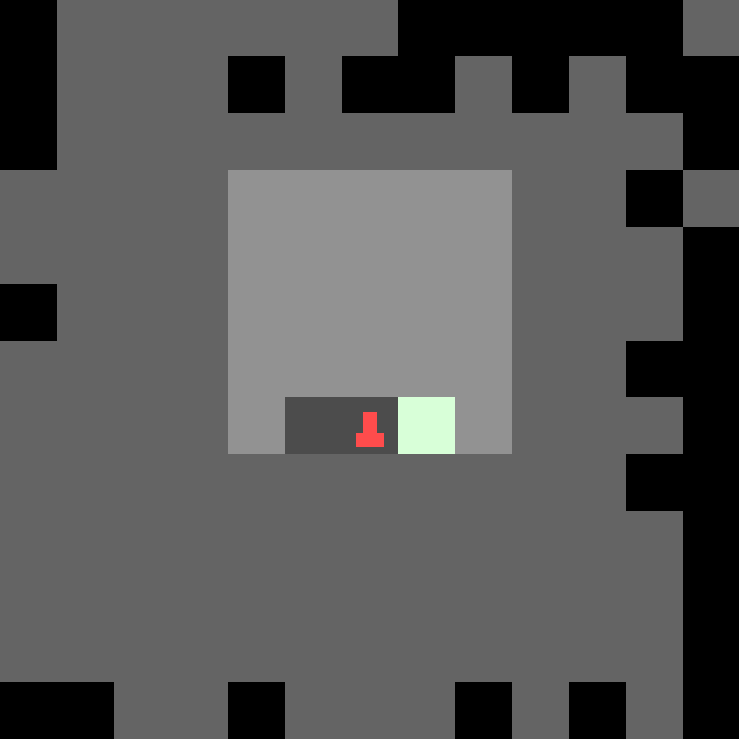
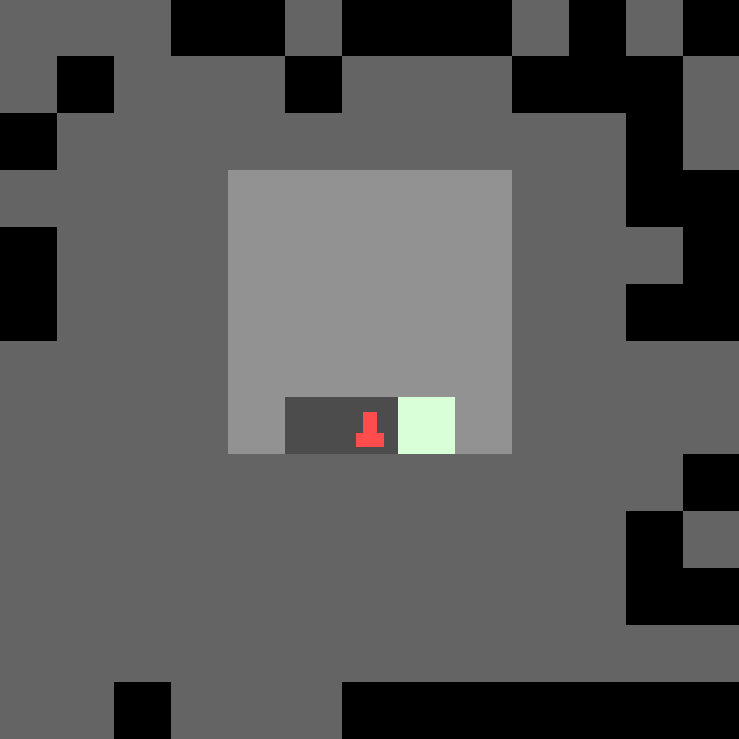
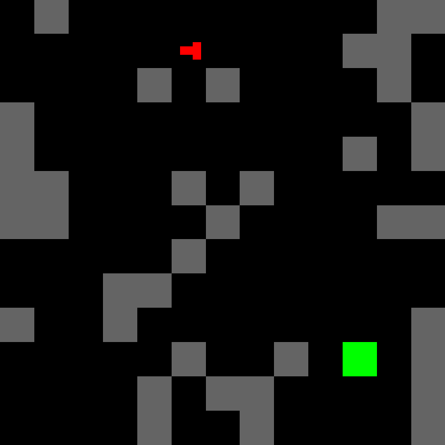
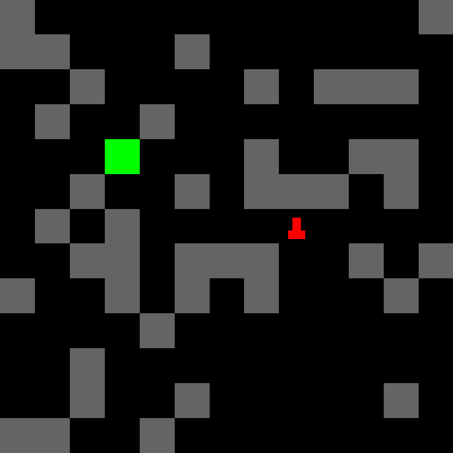
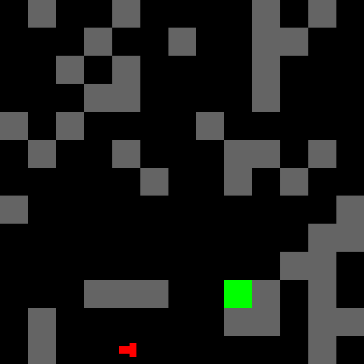

# Bayesian Level Perfect Minimax Regret: A ReMiDi 💉 to Irreducible Regret
<p align="center">
       <a href= "#reproduction"></a>
       <a href= "https://blog.foersterlab.com/blp"></a>
       <a href= "https://arxiv.org/abs/2204.06934"></a>
</p>

---

<div style="width:100%; display:flex; flex-direction: row; gap: 10%">
    <div style="width: 45%; text-align: center;">
    Policy 1
    <br>
    <div style="width:31%; display: inline-block;">
        <video controls autoplay muted loop style="width: 100%">
        <source src="figures/tmaze_left.mp4" type="video/mp4" >
        </video>
        Regret: 1.0
    </div>
    <div style="width:31%; display: inline-block">
    <video controls autoplay muted loop style="width: 100%">
        <source src="figures/tmaze_right.mp4" type="video/mp4" >
    </video>
    Regret: 1.0
    </div>
    <div style="width:31%; display: inline-block">
        <video controls autoplay muted loop style="width: 100%">
        <source src="figures/maze_spin_0.mp4" type="video/mp4" >
        </video>
        Regret: 0.9
    </div>
</div>
    
<div style="width: 45%; text-align: center;">
    Policy 2
    <br>
    <div style="width:31%; display: inline-block;">
        <video controls autoplay muted loop style="width: 100%">
        <source src="figures/tmaze_left.mp4" type="video/mp4" >
        </video>
        Regret: 1.0
    </div>
    <div style="width:31%; display: inline-block">
    <video controls autoplay muted loop style="width: 100%">
        <source src="figures/tmaze_right.mp4" type="video/mp4" >
    </video>
    Regret: 1.0
    </div>
    <div style="width:31%; display: inline-block">
        <video controls autoplay muted loop style="width: 100%">
        <source src="figures/maze_good_0.mp4" type="video/mp4" >
        </video>
        Regret: 0.0
    </div>
    </div>
</div>

---

This is the repository for the paper *Refining Minimax Regret for Unsupervised Environment Design*. We introduce a new objective and solution concept (called Bayesian Level Perfect Minimax Regret (BLP)) for Unsupervised Environment Design (UED) that does not fail when there are environments with irreducible regret.

This repository contains an algorithm, ReMiDi that, at equilibrium, results in a BLP policy.

<p align="middle">

</p>


## What's Included
### Environments
We have implementations of the the three primary domains used in our paper.
#### T-Maze & Mazes
This environment can either result in a T-Maze
<p align="middle">



</p>
or mazes like this:
<p align="middle">



</p>

#### Blindfold
The blindfold experiment allows the adversary to zero out the agent's observation; in all other aspects it is the same as the normal maze.
#### Lever Game
The lever game there are 64 levers to pull, one of which is correct (reward of +1), and pulling a wrong lever results in a reward of -1. The adversary can make the correct lever known or unknown to the agent. In the latter case, the reward is multiplied by 10 (to simulate a harder problem having a higher reward).

### Algorithms
#### PLR
The code for PLR is implemented in `x_minigrid_plr.py`.
#### ReMiDi
The code for our algorithm, ReMiDi, is implemented in `x_minigrid_remidi.py`.

## How it works
ReMiDi has multiple PLR buffers, and we start with the first one, performing standard PLR on it for a certain number of iterations. Thereafter, we go on to the next buffer and again perform PLR. This time, however, any level that has perfect trajectory overlap with a level in any of the previous buffers is ignored. The agent is also only updated on parts of the trajectories that do not overlap with the previous ones.

How we determine trajectory overlap is by using the parallel step environment (`lib/wrappers/parallel_step.py`). This allows us to perform the same action that we take on our current level on a set of other levels, in our case all levels from a previous buffer. 
Since our environments are deterministic, we can compare the observations of the current level to each of the previous ones to determine trajectory overlap.
## Reproduction
### Installation
Install [Jax](https://jax.readthedocs.io/en/latest/installation.html#pip-installation-gpu-cuda-installed-via-pip-easier), for instance, using something like:
```
pip install --upgrade "jax[cuda12_pip]" -f https://storage.googleapis.com/jax-releases/jax_cuda_releases.html
```
And then the other packages:
```
pip install orbax-checkpoint==0.4.8 flax numpy wandb matplotlib pandas gymnax pygame distrax moviepy imageio
```

Finally, install JaxUED by following the instructions [here](https://github.com/DramaCow/jaxued).

A `requirements.txt` file is also provided.

### Running
In general, you can run 
```
python x_minigrid_plr.py
```
for PLR, with arguments specified in `lib/common/arguments.py`.


Or, to run ReMiDi (which has four additional arguments specified in `x_minigrid_remidi.py`)
```
python x_minigrid_remidi.py
```

The scripts in the `scripts` directory have the command line flags to run each of our experiments.

## Acknowledgements
- This code uses [JaxUED](https://github.com/DramaCow/jaxued) as a library, and also uses code from its examples.

## Citation
For attribution in academic work, please cite our work as

```bibtex
@inproceedings{beukman2024Refining,
  title={Refining Minimax Regret for Unsupervised Environment Design},
  author={Beukman, Michael and Coward, Samuel and Matthews, Michael and Fellows, Mattie and Jiang, Minqi and Dennis, Michael and Foerster, Jakob},
  booktitle={International Conference on Machine Learning},
  year={2024},
organization={PMLR}

}
```